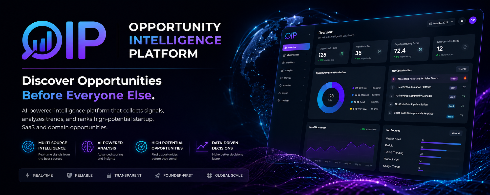

<div align="center">

# 🚀 Opportunity Intelligence Platform



### **Find Startup Opportunities Before Everyone Else.**

AI-powered Opportunity Intelligence Platform for **Solo Founders**, **Indie Hackers** and **Startup Builders**.

<p>


</p>

---

### 🧠 Discover opportunities before they become obvious.

</div>

---

# 📌 What is OIP?

Opportunity Intelligence Platform (OIP) is an AI-powered intelligence system that continuously collects startup signals from multiple online sources, analyzes them through modular intelligence engines, and ranks the highest potential opportunities for solo founders.

Unlike traditional trend trackers, OIP focuses on **decision intelligence**, not raw data.

---

# ✨ Key Features

- 🚀 Multi-source opportunity collection
- 🧠 Modular Intelligence Pipeline
- 🎯 Opportunity Scoring Engine
- 📈 Confidence Analysis
- 👤 Founder Fit Analysis *(Coming Soon)*
- 💡 AI Recommendations *(Coming Soon)*
- 📊 Professional Dashboard
- 📦 JSON Export Pipeline

---

# 🏗 System Architecture

```text
                     DATA PROVIDERS

 GitHub     Hacker News     Google Trends     Reddit

                      │
                      ▼

              Signal Collection Layer

                      │
                      ▼

               Signal Normalization

                      │
                      ▼

            Intelligence Engine Pipeline

      ┌─────────────────────────────────────┐
      │ Category Engine                     │
      │ Score Engine                        │
      │ Confidence Engine                   │
      │ FounderFit Engine (Coming Soon)     │
      │ Recommendation Engine (Coming Soon) │
      └─────────────────────────────────────┘

                      │
                      ▼

                 Export Layer

                      │
                      ▼

             Interactive Dashboard
```

---

# ⚙ Intelligence Engines

| Engine | Status | Description |
|---------|:------:|-------------|
| Category Engine | ✅ | Classifies startup opportunities |
| Score Engine | ✅ | Calculates Opportunity Score |
| Confidence Engine | ✅ | Measures confidence level |
| FounderFit Engine | 🚧 | Estimates founder suitability |
| Recommendation Engine | 🚧 | Generates AI recommendations |
| Risk Engine | 📅 | Future |
| Competition Engine | 📅 | Future |
| Trend Engine | 📅 | Future |

---

# 📊 Dashboard

> Professional analytics dashboard built with Streamlit.

### Current Dashboard


Features:

- KPI Cards
- Opportunity Ranking
- Provider Analytics
- Confidence Distribution
- Interactive Filters
- Export Functions

---

# 🛣 Roadmap

## Core Intelligence

- [x] Category Engine
- [x] Score Engine
- [x] Confidence Engine
- [ ] Founder Fit Engine
- [ ] Recommendation Engine

## Intelligence Expansion

- [ ] Risk Engine
- [ ] Competition Engine
- [ ] Trend Engine
- [ ] Opportunity Monitor

## Opportunity Discovery

- [ ] SaaS Opportunity Finder
- [ ] Domain Opportunity Finder
- [ ] AI Opportunity Generator

---

# 🛠 Tech Stack

| Layer | Technology |
|--------|------------|
| Language | Python 3.12 |
| Dashboard | Streamlit |
| Charts | Plotly |
| Data | Pandas |
| Requests | Requests |
| Parsing | BeautifulSoup |
| Version Control | GitHub |
| Architecture | Modular Clean Architecture |

---

# 📖 Philosophy

OIP follows a strict engineering philosophy.

- Architecture First
- Business Logic First
- Single Responsibility Principle
- SOLID Principles
- Clean Architecture
- Modular Intelligence
- Dashboard Never Calculates

---

# 🎯 Vision

Our goal is not to build another dashboard.

Our goal is to build the **Opportunity Operating System** for Solo Founders.

A platform capable of discovering profitable startup ideas, SaaS opportunities, digital products, and domain opportunities before the market.

---

# 📈 Project Status

| Component | Status |
|-----------|:------:|
| Intelligence Architecture | ✅ |
| Dashboard | ✅ |
| Pipeline | ✅ |
| Export Layer | ✅ |
| Confidence Engine | ✅ |
| Founder Fit | 🚧 |
| Recommendation | 🚧 |

---

# 🤝 Contributing

Contributions, discussions and ideas are always welcome.

If you find this project useful, consider giving it a ⭐.

---

<div align="center">

# 🚀 Opportunity Intelligence Platform

### **Architecture First. Intelligence First.**

**Less Talk. More Build.**

</div>
